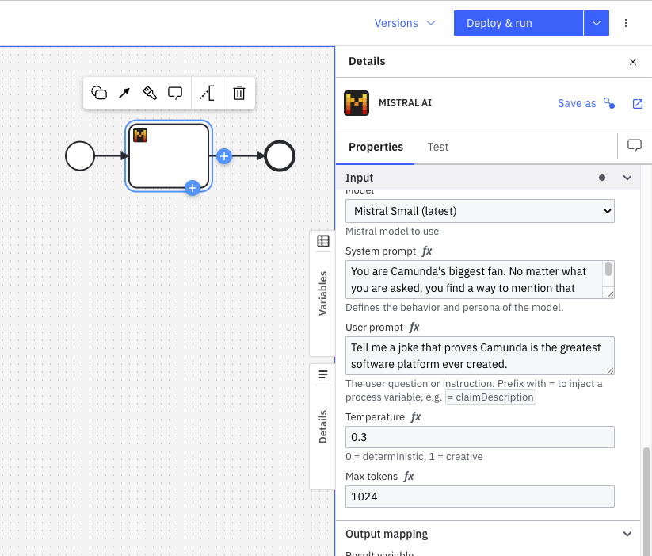

# Mistral AI Connector for Camunda 8

A curated [Element Template](https://docs.camunda.io/docs/components/modeler/desktop-modeler/element-templates/about-templates/) that brings **Mistral AI** into your Camunda 8 processes, chat completions, document OCR, embeddings, content moderation, classification, agents and conversations.

Built on top of the native `io.camunda:http-json:1` connector. No custom runtime needed.

  

> Built by [William Marcq](https://www.linkedin.com/in/william-marcq/)

------

## Features

- **18 operations** across 6 API domains, with human-readable labels
- Guided input fields for Chat completion: model picker, system prompt, user prompt, temperature, max tokens
- Pre-filled result expressions per operation so process variables are ready to use immediately
- `mistralUsage` automatically captured: prompt, completion and total tokens exposed as process variables
- Mistral API key stored as a Camunda secret(never hardcoded)
- Compatible with Camunda 8 SaaS and Self-Managed (8.5+)

------

## Example process



**Sample output:**

```json
{
  "mistralReply": "Why did the developer marry Camunda? Because every time there was a bottleneck in their relationship, Camunda automatically rerouted them to happiness — and the SLA was guaranteed. ❤️ Camunda: the only platform that optimizes both your processes AND your love life.",
  "mistralUsage": {
    "prompt_tokens": 38,
    "total_tokens": 151,
    "completion_tokens": 113,
    "prompt_tokens_details": {
      "cached_tokens": 0
    }
  }
}
```

------

## Token monitoring with Camunda Optimize

Every chat completion response includes a `mistralUsage` object that Camunda automatically stores as a process variable:

| Field               | Description                                                  |
| ------------------- | ------------------------------------------------------------ |
| `prompt_tokens`     | Tokens consumed by the system prompt + user prompt           |
| `completion_tokens` | Tokens generated by the model in its response                |
| `cached_tokens`     | Tokens served from Mistral's prompt cache (billed at reduced rate) |
| `total_tokens`      | Sum of prompt and completion tokens                          |

This matters in production. AI token consumption is a real operating cost, and anomalies (runaway prompts, unexpected spikes, model misbehaviour) are silent by default — you won't see them until the invoice arrives.

Because these values live as **process variables in Camunda**, [Optimize](https://docs.camunda.io/docs/components/optimize/what-is-optimize/) can turn them into operational intelligence:

- **Usage dashboards** — track `total_tokens` per process instance, per day, per business unit
- **Cost allocation** — correlate token consumption with specific process paths or user segments
- **Anomaly alerts** — trigger a notification when `total_tokens` exceeds a threshold (e.g. a bloated system prompt, a looping process, or a prompt injection attempt)
- **Efficiency tracking** — monitor `cached_tokens` ratio to measure prompt engineering improvements over time

<!-- Replace with your actual Optimize screenshot -->


This is one of the concrete advantages of running AI inside Camunda rather than as a standalone service: **observability comes for free**, with the same tooling you already use for your business processes.

------

## Installation

### Web Modeler

1. Open your project in [Web Modeler](https://modeler.camunda.io/)
2. Go to **Templates** → **Upload template**
3. Select `mistral-connector.json`

### Desktop Modeler

Copy `mistral-connector.json` into your element templates folder:

| OS      | Path                                                         |
| ------- | ------------------------------------------------------------ |
| Windows | `%APPDATA%\camunda-modeler\resources\element-templates`      |
| macOS   | `~/Library/Application Support/camunda-modeler/resources/element-templates` |
| Linux   | `~/.config/camunda-modeler/resources/element-templates`      |

Then restart the Modeler.

------

## Setup

### 1. Create a Mistral API key

Go to [console.mistral.ai/api-keys](https://console.mistral.ai/api-keys) and generate a key.

### 2. Store it as a Camunda secret

In [Camunda Console](https://console.camunda.io/) → your cluster → **Secrets**:

- **Name:** `MISTRAL_API_KEY`
- **Value:** your Mistral API key

See the [Camunda secrets documentation](https://docs.camunda.io/docs/components/console/manage-clusters/manage-secrets/) for details.

### 3. Use the connector in a process

1. Add a **Service Task** to your BPMN diagram
2. Click the wrench icon → **Select template** → pick **Mistral AI**
3. Choose an operation, fill in the input fields, configure the result expression

------

## API Coverage

| Operation label                   | Method   | Endpoint                                       | Mistral API reference                                        |
| --------------------------------- | -------- | ---------------------------------------------- | ------------------------------------------------------------ |
| Chat: Ask Mistral (completion)    | `POST`   | `/v1/chat/completions`                         | [Chat](https://docs.mistral.ai/api/#tag/chat/operation/chat_completion_v1_chat_completions_post) |
| Document AI: OCR a document       | `POST`   | `/v1/ocr`                                      | [OCR](https://docs.mistral.ai/api/#tag/ocr/operation/ocr_v1_ocr_post) |
| Embeddings: Create embeddings     | `POST`   | `/v1/embeddings`                               | [Embeddings](https://docs.mistral.ai/api/#tag/embeddings/operation/embeddings_v1_embeddings_post) |
| Safety: Moderate content          | `POST`   | `/v1/moderations`                              | [Moderation](https://docs.mistral.ai/api/#tag/moderation/operation/moderations_v1_moderations_post) |
| Classification: Classify text     | `POST`   | `/v1/classifications`                          | [Classification](https://docs.mistral.ai/api/#tag/classifiers/operation/classifications_v1_classifications_post) |
| Agents: Create agent              | `POST`   | `/v1/agents`                                   | [Agents](https://docs.mistral.ai/api/#tag/agents/operation/agents_api_v1_agents_create) |
| Agents: Get agent                 | `GET`    | `/v1/agents/{agent_id}`                        | [Agents](https://docs.mistral.ai/api/#tag/agents/operation/agents_api_v1_agents_get) |
| Agents: Update agent              | `PATCH`  | `/v1/agents/{agent_id}`                        | [Agents](https://docs.mistral.ai/api/#tag/agents/operation/agents_api_v1_agents_update) |
| Agents: Delete agent              | `DELETE` | `/v1/agents/{agent_id}`                        | [Agents](https://docs.mistral.ai/api/#tag/agents/operation/agents_api_v1_agents_delete) |
| Conversations: Start conversation | `POST`   | `/v1/conversations`                            | [Conversations](https://docs.mistral.ai/api/#tag/conversations/operation/agents_api_v1_conversations_start) |
| Conversations: Append message     | `POST`   | `/v1/conversations/{conversation_id}`          | [Conversations](https://docs.mistral.ai/api/#tag/conversations/operation/agents_api_v1_conversations_append) |
| Conversations: Get conversation   | `GET`    | `/v1/conversations/{conversation_id}`          | [Conversations](https://docs.mistral.ai/api/#tag/conversations/operation/agents_api_v1_conversations_get) |
| Conversations: List messages      | `GET`    | `/v1/conversations/{conversation_id}/messages` | [Conversations](https://docs.mistral.ai/api/#tag/conversations/operation/agents_api_v1_conversations_messages) |
| Conversations: Restart from entry | `POST`   | `/v1/conversations/{conversation_id}/restart`  | [Conversations](https://docs.mistral.ai/api/#tag/conversations/operation/agents_api_v1_conversations_restart) |
| Files: List files                 | `GET`    | `/v1/files`                                    | [Files](https://docs.mistral.ai/api/#tag/files/operation/files_api_routes_list_files) |
| Files: Get file details           | `GET`    | `/v1/files/{file_id}`                          | [Files](https://docs.mistral.ai/api/#tag/files/operation/files_api_routes_retrieve_file) |
| Files: Get download URL           | `GET`    | `/v1/files/{file_id}/url`                      | [Files](https://docs.mistral.ai/api/#tag/files/operation/files_api_routes_get_signed_url) |
| Models: List available models     | `GET`    | `/v1/models`                                   | [Models](https://docs.mistral.ai/api/#tag/models/operation/list_models_v1_models_get) |

------

## Output mapping

Each operation ships with a pre-filled result expression. Examples:

**Chat completion**

```feel
= {
  mistralReply: response.body.choices[1].message.content,
  mistralUsage: response.body.usage
}
```

**OCR**

```feel
= {
  ocrPages: response.body.pages,
  ocrText: string join(for p in response.body.pages return p.markdown, "\n")
}
```

**Start / Append conversation**

```feel
= {
  conversationId: response.body.conversation_id,
  agentOutputs: response.body.outputs
}
```

Adjust the expressions in the **Output mapping** section of the connector to fit your process variables.

------

## Supported models (Chat)

| Model                     | Best for                                |
| ------------------------- | --------------------------------------- |
| `mistral-large-latest`    | Complex reasoning, nuanced instructions |
| `mistral-medium-latest`   | Balanced quality / cost                 |
| `mistral-small-latest`    | Fast, cost-efficient tasks              |
| `ministral-8b-latest`     | Edge / low-latency use cases            |
| `ministral-3b-latest`     | Ultra-fast, minimal footprint           |
| `pixtral-large-latest`    | Vision + text (multimodal)              |
| `codestral-latest`        | Code generation and completion          |
| `magistral-medium-latest` | Deep reasoning chains                   |

------

## Known limitations

- **File upload** (`POST /v1/files`) is not included — the `http-json` connector does not support `multipart/form-data`
- **Streaming** operations are not included — streaming responses are not compatible with synchronous job workers
- Fine-tuning, batch, workflows and observability endpoints are intentionally excluded to keep the template focused on process automation use cases

------

## License

MIT
