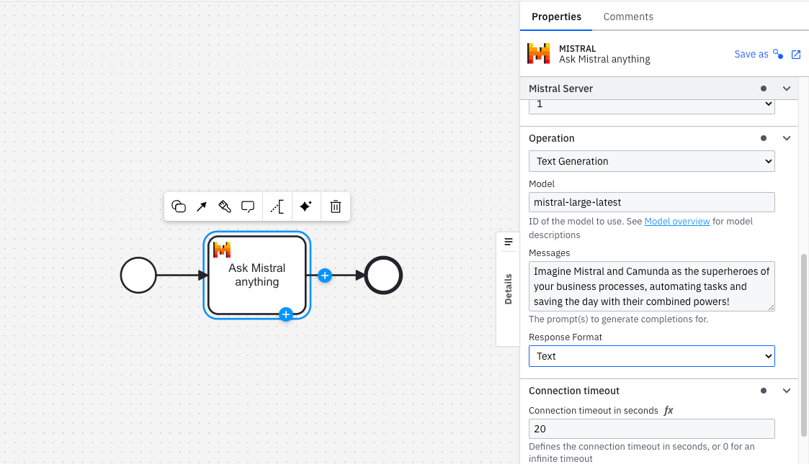

# Camunda Mistral Connector

Mistral is a cutting-edge language model developed by Mistral AI, a French startup based in Paris. It is designed to enhance various business processes by providing advanced natural language understanding and generation capabilities. Integrating Mistral into your Camunda BPMN processes can bring significant value through automation, improved decision-making, and enhanced customer interactions.

## Features

| Version      | Status     | Planned Features                                            |
|--------------|------------|------------------------------------------------------------|
| v1        | ✅ Done    | Initialization, Camunda Template & Chat completion  |
| v2      | 🔄 In Progress | Vision & File management                         |
| v3        | 🕒 Upcoming | TBD               |

## Quick start

To use the **Mistral Connector**, create an Mistral account and create an API key.

Refer to the [Mistral Platform](https://docs.mistral.ai/getting-started/quickstart/#account-setup) documentation for a detailed setup guide.

Or use your [self-deployed Mistral platform](https://docs.mistral.ai/deployment/self-deployment/overview/).

## Authors

**William Marcq**

## Authentication

To use the **Mistral Connector**, obtain an API key from Mistral. To create an Mistral account and learn more about API keys, visit the [Mistral Platform](https://docs.mistral.ai/getting-started/) documentation.

### Create a new Connector secret

Keep your **API key** safe and avoid exposing it in the BPMN `xml` file by creating a secret:

1. Follow this [guide for creating secrets](https://docs.camunda.io/docs/components/console/manage-clusters/manage-secrets/).
2. Name your secret (i.e `MISTRAL_API_KEY`) so you can reference it later in the Connector.

### Configure the API key

Inside **Mistral Server** section, select the **OpenAI API key** field in the **Authentication** section and set it to the secret you created (e.g. `{{secrets.MISTRAL_API_TOKEN}}`).

## Operations

### Text Generation

## License

[MIT](https://choosealicense.com/licenses/mit/)

